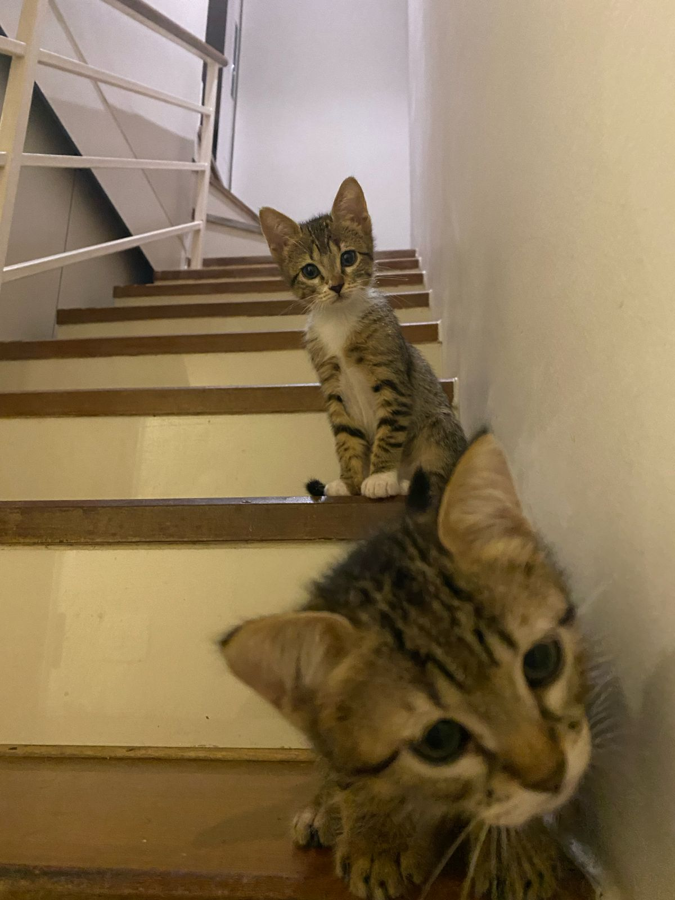

# Haru e Maze Extensão

## Descrição

Esta extensão do Visual Studio Code adiciona um vídeo animado dos gatos Haru e Maze para aliviar o estresse durante a programação intensa. O vídeo aparece como uma sobreposição no canto superior direito da tela do editor.

## Funcionalidades

- Adiciona um vídeo animado de Haru e Maze como sobreposição no canto superior direito da tela do editor.
- O vídeo é arrastável e pode ser posicionado em qualquer lugar da tela.

## Como Ativar a Extensão

1. Abra qualquer arquivo no editor do Visual Studio Code.
2. Abra a Paleta de Comandos com `Ctrl+Shift+P`.
3. Digite e selecione `Show Haru and Maze`.

## Notas de Lançamento

### 1.0.1

- Lançamento inicial da extensão Haru e Maze Cat.
- Adiciona o vídeo animado de Haru e Maze que pode ser arrastado na tela.

## Contribuindo

Se você encontrar problemas ou tiver sugestões, por favor, abra uma issue no repositório do projeto.

# Haru and Maze Extension

## Description

This Visual Studio Code extension adds an animated video of the cats Haru and Maze to relieve stress during intense coding sessions. The video appears as an overlay in the top right corner of the editor screen.

## Features

- Adds an animated video of Haru and Maze as an overlay in the top right corner of the editor screen.
- The video is draggable and can be positioned anywhere on the screen.

## How to Activate the Extension

1. Open any file in the Visual Studio Code editor.
2. Open the Command Palette with `Ctrl+Shift+P`.
3. Type and select `Show Haru and Maze`.

## Release Notes

### 1.0.1

- Initial release of the Haru and Maze Cat extension.
- Adds an animated video of Haru and Maze that can be dragged around the screen.

## Contributing

If you encounter issues or have suggestions, please open an issue in the project repository.

